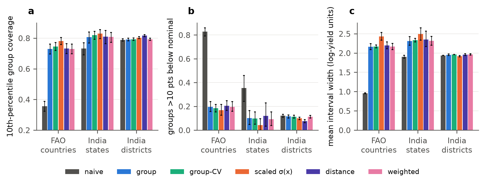
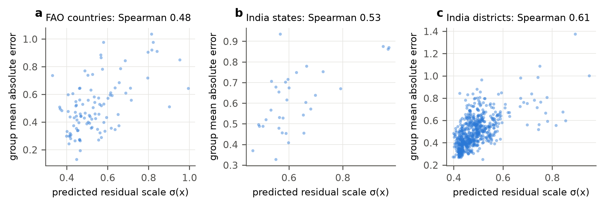
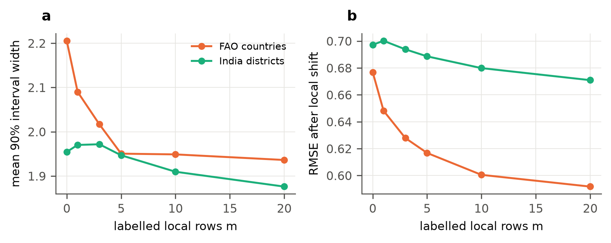

::: {custom-style="Title"}
Duplicated records and region shift in crop-yield benchmarks: an audit, a transfer study and calibrated uncertainty for unseen countries and districts
:::

::: {custom-style="Author"}
[Author names to be added]
:::

::: {custom-style="Affiliation"}
[Affiliations and corresponding author to be added]
:::

::: {custom-style="Heading Unnumbered"}
Highlights
:::

- 53% of rows in a public FAO-derived yield file are join fan-out copies, traced exactly
- A country–crop lookup matches tuned boosting on random splits; held-out countries fall to R² 0.66
- Naive conformal intervals cover 60% (50% on raw rows) instead of 90% on unseen countries
- Collapse follows the group fingerprint: random forest 47%, boosting 59%, ridge 88%
- Group-aware calibration restores 90%; a learned scale helps weak groups modestly

::: {custom-style="Heading Unnumbered"}
Abstract
:::

Public crop-yield tables are routinely used to train and compare machine-learning models, usually with random train–test splits and with prediction intervals calibrated on random hold-out rows. We audit two public sources, a country-level file derived from FAOSTAT and other tables (28,242 rows, 101 countries, 10 crops, 1990–2013) and an Indian district-level production table (246,091 rows, 33 states, 652 districts, 1997–2015), and study what these habits hide. The FAO file holds 13,130 distinct country–crop–year records; the other rows are copies created when yield records were joined to a temperature table with several rows per country and year (the row count of every record equals its join multiplicity). Public code repositories have noted this duplication informally; we trace and quantify it. Rainfall is constant within a country, and temperature and pesticide use are nearly country labels (intraclass correlations 1.00, 0.995 and 0.78). Random splits therefore reward recognising the country: tuned gradient boosting reaches R² = 0.93 on random rows and 0.66 on held-out countries, a crop-mean predictor scores 0.58 and 0.57, and a country–crop lookup with no covariates already reaches 0.93 on random rows and 0.89 forward in time (tuned boosting 0.91). Within-country anomalies of temperature and pesticide use add real within-country skill (RMSE 9–11% below the lookup) but no cross-country skill. For split conformal prediction at a nominal 90%, calibration on random rows gives 60% coverage on unseen FAO countries (50% on the raw duplicated rows), 84% on unseen Indian states and 90% on districts, and group-aware calibration restores 90% in all settings. The collapse follows the group fingerprint in the features: random forest 47%, gradient boosting 59% and ridge regression 88% on the same data, and 83% when fingerprint-free features are used. A relation, coverage ≈ 2Φ(z/ρ) − 1 with ρ the ratio of test to calibration residual scale, tracks a simulation to within 0.013 (cell means) and links the problem to the inflation ratio of group leakage. Weighted conformal prediction cannot help, because calibration and test rows are perfectly separable (AUC 1.0). A learned residual-scale model flags difficult groups (group-level Spearman 0.48 to 0.61, against 0.11 to 0.39 for a distance score; clearly better only for districts) and modestly lifts coverage in the weakest groups at the cost of wider intervals, while five labelled local rows narrow FAO intervals by 12%. We provide an audit procedure, a protocol and open code.

::: {custom-style="Keywords"}
**Keywords:** crop yield prediction; data leakage; duplicate records; conformal prediction; distribution shift; grouped validation; FAOSTAT; uncertainty quantification
:::

# Introduction

Machine-learning studies of crop yield usually start from a public table, fit a flexible model and report a held-out error or $R^2$ [1]. Two choices rarely questioned in that workflow determine how much the reported numbers mean. The first is the split: rows are assigned to training and test sets at random, which presumes that rows are exchangeable. The second is the uncertainty statement: prediction intervals, when they are produced at all, are calibrated on a random hold-out set under the same presumption. Crop-yield tables violate the presumption by construction. They list the same country, region or district year after year and crop after crop, so rows that belong to the same place are close relatives, and a model that has seen a place can predict it well without having learned anything transferable to a place it has not seen.

This is the grouped-data version of data leakage, which has been shown to inflate reported results in many fields [2] and which is the reason ecologists, remote-sensing scientists and statisticians recommend blocked, spatial or leave-group-out validation [3, 4]. In crop yield the practical question is the transfer question: a model trained on some countries or districts is meant to be used in others where yield data are scarce. Critiques of validation design in published yield studies have appeared [5], and leave-one-country-out evaluation is beginning to be reported [6], and public code repositories built on the FAO-derived file below note informally that it contains repeated rows and that random splits are optimistic [7, 8]. We are not aware of a scholarly, record-level trace of why the random-split scores on this file are inflated, nor of a study of whether the intervals attached to such models keep their nominal coverage when the target place is new.

We address both gaps with two public sources: a country-level file derived from FAOSTAT and other tables [9, 10] and a district-level production table for India [11]. Our contributions are:

1. **A verified, quantified audit of duplicated records.** The duplication has been noted in public repositories [7, 8]; we verify it against the component tables, show that the excess is an exact join fan-out (each record is repeated as many times as the temperature table has rows for the country and year), and show that the covariates are close to country identifiers (Section 6.1).
2. **A transfer study with honest baselines.** Under random, forward-in-time and group-held-out protocols, with tuned models, a group-identifier model and a crop-mean baseline, we measure how much of the apparent skill is memorisation of the place (Section 6.2).
3. **Coverage collapse and its explanation.** We show that split conformal intervals calibrated on random rows lose most of their coverage on unseen countries, relate the loss to the inflation ratio of group leakage through a simple relation (Section 3), and show with three settings and three model families that it tracks how well the features identify the group (Sections 6.3 and 6.4).
4. **Group-aware calibration and its limits.** We compare six calibration schemes, including a learned residual-scale normalisation, a distance score and weighted conformal prediction, explain why weighting fails, and quantify what a handful of local labels buys (Sections 6.5 to 6.7).
5. **A test of the fingerprint explanation.** With a place-lookup baseline and fingerprint-free (within-country anomaly) features we separate what the covariates add within a country from what the random split rewards (Section 6.8).

The paper is a companion to a study of group leakage in tabular regression benchmarks [12], whose inflation ratio $\rho$ and intraclass-correlation bound we reuse; the present work concerns agricultural data, uncertainty statements and the specific mechanism by which this file was assembled. We restrict ourselves to evaluation: we do not propose a new yield model and our baselines use only the covariates that the files contain.

The remainder of the paper is organised as follows. Section 2 reviews related work. Section 3 gives the theory. Section 4 describes the data and Section 5 the experimental design. Section 6 reports results, Section 7 discusses implications and limitations, and Section 8 concludes.

# Related work

**Machine learning for crop yield.** Systematic reviews describe a literature dominated by tree ensembles, neural networks and regularised regression applied to climate, soil, management and remote-sensing covariates [1]. Evaluation designs in this literature vary, and a recent critique of common issues in published crop-yield studies points to validation that does not match the intended use, including random cross-validation of spatially and temporally structured data [5]. A recent preprint reports that cross-country transfer of yield models in Sub-Saharan Africa is far worse than within-country skill suggests [6]. Our contribution is complementary: we dissect one concrete, publicly shared benchmark file, quantify the effect of its construction on evaluation, and extend the question from point accuracy to interval coverage.

**Leakage, duplicates and structured validation.** Leakage has been catalogued across disciplines and is a major source of irreproducible results [2]. Benchmark duplicates are a specific form: near-duplicate images shared by training and test sets of CIFAR inflate reported accuracy [13], and general guidance on avoiding machine-learning pitfalls lists such overlap among the most common errors [14]. For data with spatial, temporal, hierarchical or phylogenetic structure, blocked cross-validation gives more realistic estimates than random folds [3], and spatial validation has overturned apparent skill in large-scale ecological mapping [4]. The WILDS benchmarks make the same point for domain shift in general [15]. Mixed-effects approaches show that standard tree ensembles ignore within-cluster dependence [16]. We build on these results by tracing the origin of duplication in a specific file, by relating the memorisation of group identity to the behaviour of conformal intervals, and by comparing model families on the same data.

**Conformal prediction under shift.** Split conformal prediction gives finite-sample marginal coverage for exchangeable data [17–19]. When exchangeability fails, coverage can degrade; weighted conformal prediction restores validity under a known covariate shift [20], and non-exchangeable variants bound the coverage loss [21]. Cross-conformal and jackknife+ methods reuse all data for calibration [22]. Locally adaptive intervals use a model of the residual scale [23], and Mondrian or group-conditional calibration targets coverage within groups [24, 25]. Prediction sets for two-layer hierarchical data treat groups as the exchangeable unit [26]. In agriculture, conformal prediction has been analysed for image-based decision support [27], and group-conditional calibration has been used for crop and weed classification [28]. We are not aware of work on tabular yield regression that examines how calibration on random rows fails for unseen countries or districts. Our contribution is empirical and diagnostic: we show when naive calibration collapses, relate the collapse to the inflation ratio of group leakage, and compare these existing remedies (group-aware, locally scaled, weighted and cross-conformal) under a common protocol.

**Spatial and group-weighted conformal methods.** Conformal methods for spatial data localise the calibration, using localized quantile regression [29] or geographically weighted scores [30], and group-weighted conformal prediction treats the group as the determinant of covariate shift between training and test populations [31]. These methods rely on overlap between the calibration and test populations. Here the test groups are new, calibration and test sets are perfectly separable by a classifier, and we show in Section 6.5 why weighting then has nothing to work with.

**Informal notes on the FAO-derived file.** Public code repositories built on the file record that it has 13,130 unique keys among 28,242 rows, that the repeated rows differ only in temperature, and that random splits give optimistic scores [7, 8]. These notes are not peer-reviewed and do not trace the join mechanism row by row, quantify the effect on protocols, or study intervals; we credit them and build on them.

**Applicability of spatial models.** The area-of-applicability approach flags prediction locations whose predictor values lie outside the range seen in training [32]. We test a related group-level distance score and a learned residual-scale score as indicators of where intervals are likely to be too narrow.

Table 1 summarises how the present study relates to these strands.

Table: Table 1. Positioning of the present study relative to the main strands of related work.

| Strand | Typical contribution | This study |
|:---|:---|:---|
| Crop-yield ML [1, 5, 6] | Models, reviews, critique of validation | Audit of one benchmark file; protocol comparison with tuned baselines |
| Leakage and duplicates [2, 13] | Catalogue; image duplicates | Traced join fan-out in a tabular yield file |
| Structured validation [3, 4] | Blocked CV; ecological mapping | Country, state and district hold-out for yield |
| Conformal under shift [20, 21, 24] | Guarantees and remedies | Collapse relation tied to group leakage; six schemes compared on yield data |
| Spatial and group-weighted conformal [29–31] | Localised or group-weighted calibration | New groups; weights degenerate (classifier AUC 1.0) |
| Applicability [32] | Area of applicability | Distance versus learned residual-scale score |
| Informal repository notes [7, 8] | Duplicates noted; optimistic scores | Verified join trace; protocols and intervals quantified |

# Theory: leakage, calibration and the coverage-collapse relation

This section links the inflation of point accuracy under random splits, studied in the companion paper [12], to the coverage of split conformal intervals. Section 3.1 fixes notation, Section 3.2 recalls the inflation ratio, Section 3.3 derives the coverage-collapse relation, Section 3.4 states when group-aware calibration is valid and why per-group coverage still varies, and Section 3.5 describes why model family matters. Derivations are in Appendix A and checks against simulation and data in Section 6. Table 2 lists the notation.

Table: Table 2. Notation.

| Symbol | Meaning |
|:---|:---|
| $g$, $G$ | Group (country, state or district) and number of groups |
| $y_{gj}$, $x_{gj}$ | Log-yield and features of row $j$ in group $g$ |
| $f$, $u_g$, $\varepsilon_{gj}$ | Shared signal, group offset, row noise; variances $\sigma_u^2$, $\sigma_\varepsilon^2$ |
| $r$ | Intraclass correlation of the residual, $r=\sigma_u^2/(\sigma_u^2+\sigma_\varepsilon^2)$ |
| $\rho$ | Inflation ratio: root-mean-square residual on test rows divided by that on calibration rows |
| $\alpha$, $z_{1-\alpha/2}$ | Miscoverage level and normal quantile |
| $\hat q$ | Conformal quantile of calibration scores |
| $\Phi$ | Standard normal distribution function |
| $c_g$ | Coverage of the interval within group $g$ |
| $\hat\sigma(x)$ | Learned residual scale used for normalised scores |

## Setting

Rows are indexed by group $g$ and position $j$ within the group, and we assume the random-effects structure

$$y_{gj} = f(x_{gj}) + u_g + \varepsilon_{gj}, \qquad u_g \sim (0,\sigma_u^2), \quad \varepsilon_{gj} \sim (0,\sigma_\varepsilon^2), \qquad\qquad (1)$$

with residual intraclass correlation

$$r = \frac{\sigma_u^2}{\sigma_u^2+\sigma_\varepsilon^2} . \qquad\qquad (2)$$

In crop-yield tables $u_g$ collects everything that is persistent for a place and not captured by the covariates: soil, farming practice, crop mix, reporting conventions. A learner that can recognise the group from its features, because the features are nearly constant within the group and differ between groups, can estimate $u_g$ from the group's other rows. We call such features a group fingerprint.

## The inflation ratio

Let $R_{\mathrm{rand}}$ and $R_{\mathrm{grp}}$ be the mean-squared errors on test rows from groups that are present or absent in training. The companion paper defines the inflation ratio $\rho=\sqrt{R_{\mathrm{grp}}/R_{\mathrm{rand}}}$ and shows that, for a learner that memorises group offsets and a correctly specified $f$,

$$\rho \le \frac{1}{\sqrt{1-r}} , \qquad\qquad (3)$$

so the largest possible inflation is set by the residual intraclass correlation, and an observed $\rho$ implies the lower bound $r \ge 1-1/\rho^2$ [12]. For $r=0.75$ the bound is $\rho\le 2$ and for $r=0.9$ it is $\rho\le 3.2$.

## Coverage collapse

Split conformal prediction forms intervals $\hat y(x)\pm\hat q$, where $\hat q$ is the $\lceil (n+1)(1-\alpha)\rceil$-th smallest absolute residual among $n$ calibration rows [17, 18]:

$$\hat q = \operatorname{Quantile}_{\lceil (n+1)(1-\alpha)\rceil/n}\bigl(\lvert y_i-\hat y(x_i)\rvert \ : \ i\in\mathrm{cal}\bigr). \qquad\qquad (4)$$

If calibration rows are exchangeable with the test row, coverage is at least $1-\alpha$. If calibration rows come from groups already seen in training while test rows come from new groups, the two residual distributions differ. When both are approximately zero-mean Gaussian with scales $\sigma_c$ (calibration) and $\sigma_t$ (test), $\hat q\approx z_{1-\alpha/2}\sigma_c$ and the actual coverage is

$$1-\alpha_{\mathrm{eff}} = 2\,\Phi\!\left(\frac{z_{1-\alpha/2}}{\rho}\right)-1 , \qquad \rho=\frac{\sigma_t}{\sigma_c} . \qquad\qquad (5)$$

The scale ratio in Eq. (5) is the inflation ratio of Section 3.2 when calibration rows play the role of rows from seen groups, which is what random hold-out rows are. Combining Eqs. (3) and (5) gives the guideline that, under the idealised memorising learner,

$$1-\alpha_{\mathrm{eff}} \ \ge\ 2\,\Phi\!\bigl(z_{1-\alpha/2}\sqrt{1-r}\bigr)-1 . \qquad\qquad (6)$$

For example, at $\alpha=0.1$ and $r=0.9$ the coverage can fall to 0.40, and at $r=0.75$ to 0.59. Equation (5) can also be inverted: an observed naive coverage $c$ implies $\rho = z_{1-\alpha/2}/\Phi^{-1}\bigl((1+c)/2\bigr)$ and therefore $r \ge 1-1/\rho^2$, which we use in Section 6.3 as a measure of how much group-specific variance the model absorbs. Equations (5) and (6) are approximations: residuals are heavier tailed than Gaussian and Eq. (3) assumes an idealised learner, so we treat them as diagnostics and test them in simulation and on data rather than as theorems.

## Group-aware calibration and per-group coverage

The remedy is to calibrate on groups the model has not seen. 

**Proposition 1.** Let the groups be exchangeable draws from a population of groups. Fit the model on one set of groups, and compute scores on rows from a disjoint set of calibration groups. For a test group exchangeable with the calibration groups, and for one row drawn from each group with the same sampling rule, the interval $\hat y(x)\pm\hat q$ with $\hat q$ from Eq. (4) covers the test row with probability at least $1-\alpha$.

This is split conformal prediction with the group as the exchangeable unit, as in two-layer hierarchical models [26]. When all rows of the calibration groups are pooled, as we do, the guarantee holds for a row drawn with probability proportional to its group's share of the calibration rows, and per-group coverage is not controlled. Within group $g$ with residual scale $\sigma_g$, Gaussian residuals give

$$c_g \approx 2\,\Phi\!\left(\frac{\hat q}{\sigma_g}\right)-1 , \qquad\qquad (7)$$

so groups with a larger residual scale than the pooled one are under-covered even when the pooled coverage equals $1-\alpha$. Heterogeneity of $\sigma_g$ therefore produces a spread of $c_g$ and a tail of poorly covered groups, and no single constant $\hat q$ removes it. Normalising scores by a learned scale $\hat\sigma(x)$, so that intervals are $\hat y(x)\pm\hat q\,\hat\sigma(x)$, narrows the spread to the extent that $\hat\sigma(x)$ predicts $\sigma_g$ [23, 24]; exact group-conditional guarantees require group-specific calibration sets [25].

## Why the model family matters

The collapse in Eq. (5) needs $\rho>1$, that is, a model whose residuals on seen groups are smaller than on unseen ones. This requires the model to exploit group identity: through features that identify the group, and through a function class flexible enough to use them. Linear models with a few covariates cannot encode hundreds of country-specific offsets from three continuous variables and a crop indicator, so we expect $\rho\approx 1$ for ridge regression, a larger $\rho$ for gradient boosting and the largest for random forests that grow deep trees [16, 33, 34]. We test this prediction in Section 6.4.

# Data

## FAO-derived country-level file

The first source is the file `yield_df.csv` from a public Kaggle dataset that combines yield and pesticide data from FAOSTAT with rainfall and temperature series from the World Bank data portal [9, 10]. The dataset page describes its provenance; we verified the structure described below directly against the four component tables distributed with it (`yield.csv`, `pesticides.csv`, `rainfall.csv`, `temp.csv`). The file has 28,242 rows covering 101 countries, 10 crops and the years 1990–2013. Each row holds the country, crop, year, yield in hg/ha, average annual rainfall (mm), pesticide use (tonnes) and average temperature (°C). We model the logarithm of yield. We call a **record** a distinct country–crop–year combination.

## Indian district-level table

The second source is a district-level table of area and production by crop and season in India for 1997–2015 [11]. It has 246,091 rows, 33 states, 652 districts and 124 crops, and no weather variables. We removed rows with missing production or non-positive area or production, computed yield as production divided by area, dropped crops with fewer than 20 rows, and trimmed the extreme 0.1% in each tail of log-yield. The cleaned table has 238,191 rows, 90 crops, 33 states and 652 districts. The exact cleaning rule of earlier analyses may differ; the rule above is the one used for every result reported here. We did not verify the original publication source of this table beyond the dataset page, and treat it as a convenient public benchmark.

## Groups and features

For the FAO file the group is the country. For the Indian table we use two levels, the district and the state, which gives a gradient of group identifiability. Features are deliberately limited to those the files contain, so that the experiments isolate the effect of the evaluation protocol. For FAO we use crop (one-hot), year, rainfall, pesticide use and temperature. For India we use crop and season (one-hot), year and log cultivated area. One model variant adds the group identifier as a categorical feature to quantify what a model gains from recognising the place. Table 3 summarises the datasets.

Table: Table 3. Datasets and group structure. ICC is the one-way intraclass correlation of log-yield (ANOVA estimator, unbalanced design) [35], by country and crop for FAO and by state and crop / district and crop for India.

| Dataset | Rows | Groups | Crops | Years | ICC |
|:---|---:|:---|---:|:---|:---|
| FAO file, raw rows | 28,242 | 101 countries | 10 | 1990–2013 | 0.95 |
| FAO file, distinct records | 13,130 | 101 countries | 10 | 1990–2013 | 0.94 |
| India, cleaned | 238,191 | 33 states; 652 districts | 90 | 1997–2015 | 0.88 / 0.90 |

## Audit procedure

We rebuilt `yield_df.csv` from its component tables to trace the repeated rows. For each record we counted the rows in the temperature table for the same country and year and compared the count with the number of rows in `yield_df.csv` for that record. We measured the within-country-year spread of temperature in the source, checked whether yield values agree with the FAO yield table, and computed intraclass correlations of the covariates by country on the raw rows, on the distinct records and, for pesticides, in the source table. The audit code is `src/c01_audit.py` and `src/c06_audit_origin.py`.

# Experimental design

## Protocols

We compare three evaluation protocols. **Random**: five-fold cross-validation over rows. **Forward in time**: train on all years up to a cut-off and test on the next three years, for three cut-offs. **Group-held-out**: five-fold cross-validation over groups, so that every test group is absent from training; this is used with countries for FAO and with districts and states for India. Group splits use three different random seeds (five for the conformal experiments on FAO) and report averages over seeds and folds with 95% bootstrap intervals over the fold-level results.

## Models

We evaluate a crop-mean predictor (the mean log-yield of the crop in the training rows, a no-skill reference that uses no place information), ridge regression [36], random forest [33] (200 trees, minimum leaf size 2; trained on a random subset of 40,000 rows for the Indian data), gradient boosting with LightGBM defaults [34, 37], tuned gradient boosting, and gradient boosting with the group identifier as a categorical feature. Tuning selects among four configurations of leaves, learning rate, trees and minimum leaf size using an inner validation matched to the outer protocol (random, group-held-out or forward-in-time folds), on a subsample of at most 30,000 training rows. Implementations are from scikit-learn [38] and LightGBM [37].

## Conformal prediction experiments

All conformal experiments use gradient boosting as the base model and absolute residuals as scores, at $\alpha\in\{0.05,0.1,0.2\}$. For each outer fold the training groups are split into fit groups (70%) and calibration groups (30%). We compare six schemes.

1. **Naive**: calibration rows are a random 30% of the training rows, drawn from the same groups as the fit rows (the usual practice).
2. **Group**: calibration on the calibration groups, disjoint from the fit groups (Section 3.4).
3. **Group-CV**: cross-conformal calibration with five group folds over all training groups; scores are out-of-group residuals and the prediction is the mean of the five fold models [22].
4. **Scaled**: group calibration with scores divided by a learned residual scale $\hat\sigma(x)$, fitted by gradient boosting to out-of-group residuals of the fit groups; intervals are $\hat y\pm\hat q\hat\sigma(x)$ [23].
5. **Distance**: group calibration with scores divided by $a+b\,d$, where $d$ is the mean distance from a group's standardised covariate profile to its five nearest fit groups and $a,b$ are fitted by least squares on calibration groups, in the spirit of applicability scores [32].
6. **Weighted**: group calibration with importance weights from a classifier separating calibration rows from test rows [20]; weights are clipped to $[0.05,20]$ and the test-point mass is approximated by the mean weight.

We report empirical coverage, mean interval width (in log-yield units, twice the half-width), the share of groups whose coverage is more than 10 points below nominal, the 10th percentile of group-level coverage, and the standard deviation of group coverage. The applicability diagnostic is the Spearman correlation between a group's score ($d$ or the mean $\hat\sigma(x)$ over its test rows) and its mean absolute error on test rows.

## Local calibration

To test how much labelled data from the target group help, we give the model $m\in\{0,1,3,5,10,20\}$ labelled rows from each test group, shift the group's predictions by a shrunk mean residual, $\frac{m}{m+3}\times$ (mean residual of the $m$ rows), and score the remaining rows. Calibration groups are treated identically (the same $m$ rows used for the shift, the rest for scores), so the procedure is exchangeable at the group level.

## Robustness analyses

Weighted conformal prediction is diagnosed by training a domain classifier (gradient boosting, cross-fitted with shuffled three-fold validation) to separate calibration rows from test rows, for the naive calibration rows and for the calibration groups, and reporting its AUC, the effective sample size of the weights, the share of weights below the lower clipping bound and the coverage with and without weights. The naive-versus-group comparison is repeated on the 28,242 raw FAO rows. For the applicability scores, each group's score and error are averaged over seeds and folds and the correlation is bootstrapped over groups (1,000 resamples).

## Place lookups and fingerprint-free features

A **country–crop lookup** predicts the mean log-yield of the country and crop in the training rows (the crop mean when the country-crop is unseen, as in group hold-out). **Anomaly features** remove the country level: temperature minus the country's mean temperature, log(1 + pesticides) minus its country mean, together with crop and year; rainfall is dropped because it is constant within a country. Country means are computed from the features of the country's own records, which uses no labels and is available whenever a feature history exists for the country. We compare ridge regression and gradient boosting on the full and anomaly feature sets, a combination of the lookup with a gradient boosting model on the lookup's residuals, and naive and group conformal coverage and group-ID accuracy with each feature set, using the protocols above with three seeds.

## Fingerprint strength and simulation

We measure a group fingerprint two ways: the accuracy of a five-nearest-neighbour classifier that predicts the group from standardised features on random 30% held-out rows (against the share of the largest group as chance), and the mean intraclass correlation of the continuous features by group. We compare ridge regression, random forest and gradient boosting under naive and group calibration on every setting. A simulation checks Eq. (5): groups have effects $u_g\sim N(0,\tau^2)$ with $\tau\in\{0,0.25,0.5,1,1.5,2,3\}$, noise of unit variance, 60 groups and 10 or 50 rows per group, 20 replicates each, with a learner that memorises seen-group means.

## Reproducibility

All code is in the repository `deep1789/crop-2026` (`src/`, with one script per experiment), per-fold results are stored as JSON in `results/`, and tables are regenerated by `src/c10_summary.py`. Random seeds are fixed. Analyses use a four-core container; each experiment runs from the command line.

# Results

## Audit of the FAO-derived file

Table 4 summarises the audit. Of the 28,242 rows, 15,112 (53.5%) repeat an earlier country–crop–year record and 67.1% of all rows belong to a record that occurs more than once, so a model scored on random rows is scored mostly on records it has seen under another row. Every repeated record carries one distinct yield, and the yield agrees with the FAO yield table for all 13,130 records, so the repeats are copies and not conflicting measurements. What differs between copies is the temperature, which has on average 4.3 distinct values within a repeated record.

Table: Table 4. Audit of the FAO-derived file `yield_df.csv`, traced to its component tables.

| Quantity | Value |
|:---|:---|
| Rows in `yield_df.csv` | 28,242 |
| Distinct country–crop–year records | 13,130 |
| Rows that repeat an earlier record | 15,112 (53.5%) |
| Rows belonging to a repeated record | 67.1% |
| Records with more than one row | 3,837 |
| Distinct yields within a record (maximum) | 1 |
| Records whose row count equals the rows in `temp.csv` for the country-year | 100% |
| Country-years in `temp.csv` with several rows | 28% |
| Median within-country-year SD of temperature, against overall SD (°C) | 2.19 against 7.59 |
| Countries whose source rainfall is constant over years | 98% of 192 |
| Yield equals the FAO yield table (distinct records) | 100% |
| ICC by country: rainfall / temperature / pesticides (distinct records) | 1.00 / 0.995 / 0.78 |
| ICC by country: temperature / pesticides (raw rows) | 0.92 / 0.71 |
| ICC of pesticides by country in the source table | 0.94 |

The cause is a join fan-out. The temperature table has several rows for 28% of country-years, whose within-country-year standard deviation (median 2.2 °C) is a sizeable fraction of the overall spread (7.6 °C). Joining yield records to it on country and year multiplies each record by the number of temperature rows, and this number equals the number of rows of the record in `yield_df.csv` for all 13,130 records (Fig. 1a and 1b). The largest multiplicity is 22 rows, so the duplication is uneven across countries: a country with many temperature rows contributes many times more rows to any pooled evaluation than a country with one. Fig. 1c shows that the covariates are close to country identifiers: rainfall is constant within a country (intraclass correlation 1.00 and constant over years in the source for 98% of countries), temperature has an intraclass correlation of 0.995 on distinct records, and pesticide use 0.78 (0.935 in the source table, which spans more countries, and 0.71 on the raw rows). Log-yield has an intraclass correlation of 0.94 by country and crop. A learner that sees these three numbers has a very good hint about which country a row belongs to, which is the condition for memorisation in Section 3.

{width=6.4in}

The Indian table has no repeated state–district–year–season–crop keys, but its structure is also hierarchical (intraclass correlation of log-yield 0.88 by state and crop, 0.90 by district and crop). Its features carry little group information: log area has an intraclass correlation of 0.07 by state and 0.10 by district.

## Transfer: what random splits reward

Tables 5 and 6 and Fig. 2 give R² by protocol. On the FAO file, random splits rank the flexible models first (random forest 0.952, tuned gradient boosting 0.931, with group identifier 0.946) and far above the crop mean (0.580) and ridge regression (0.651). With whole countries held out all of that disappears: tuned gradient boosting scores 0.656, ridge 0.615, random forest 0.600, the crop mean 0.566, and the model that is given the country as a feature drops to 0.551, no better than the crop mean (the intervals overlap). The root-mean-square error of random forest rises from 0.247 to 0.709 (a factor of 2.9) and that of tuned gradient boosting from 0.297 to 0.657 (2.2), while ridge regression moves from 0.666 to 0.696 (1.05). Forward-in-time evaluation resembles the random split (random forest 0.924), because countries remain in training: it measures extrapolation in time within known countries, not transfer to new ones.

Table: Table 5. R² (95% bootstrap interval) on the FAO file, distinct records, by evaluation protocol.

| Model | Random | Forward in time | Country held out |
|:---|---:|---:|---:|
| Crop mean | 0.580 (0.574–0.586) | 0.560 (0.549–0.574) | 0.566 (0.542–0.590) |
| Ridge | 0.651 (0.646–0.656) | 0.629 (0.616–0.638) | 0.615 (0.588–0.641) |
| Random forest | 0.952 (0.949–0.954) | 0.924 (0.922–0.925) | 0.600 (0.572–0.629) |
| GBM (tuned) | 0.931 (0.929–0.933) | 0.907 (0.903–0.911) | 0.656 (0.631–0.684) |
| GBM + group ID | 0.946 (0.945–0.948) | 0.923 (0.920–0.925) | 0.551 (0.525–0.577) |

Table: Table 6. R² (95% bootstrap interval) on the Indian district table, by evaluation protocol.

| Model | Random | Forward in time | District held out | State held out |
|:---|---:|---:|---:|---:|
| Crop mean | 0.734 (0.732–0.735) | 0.730 (0.720–0.750) | 0.732 (0.727–0.736) | 0.675 (0.645–0.704) |
| Ridge | 0.744 (0.743–0.746) | 0.748 (0.732–0.771) | 0.742 (0.737–0.747) | 0.683 (0.650–0.716) |
| Random forest | 0.758 (0.756–0.759) | 0.716 (0.678–0.759) | 0.740 (0.735–0.745) | 0.598 (0.562–0.636) |
| GBM (tuned) | 0.767 (0.766–0.768) | 0.754 (0.741–0.776) | 0.758 (0.752–0.763) | 0.662 (0.630–0.695) |
| GBM + group ID | 0.833 (0.831–0.834) | 0.806 (0.789–0.829) | 0.732 (0.728–0.736) | 0.648 (0.603–0.687) |

{width=6.4in}

The Indian table shows the same pattern with a smaller gap, as expected from weaker fingerprints. Random-split R² is 0.778 for default gradient boosting and 0.833 when the district is given as a feature, against 0.734 for the crop mean; with districts held out the values are 0.758 (tuned gradient boosting) and 0.732 (with district ID), against 0.732 for the crop mean. With whole states held out, only random forest is clearly below the crop mean (R² 0.598 against 0.675, with non-overlapping intervals); tuned gradient boosting (0.662), the model with district ID (0.648) and ridge regression (0.683) are indistinguishable from it.

Two cautions apply to the apparent benefit of cleaning. In the earlier runs with default models, random forest on the raw FAO rows reaches R² = 0.976 against 0.953 on the distinct records, so duplicates inflate the random-split score further; with countries held out the raw rows give a *higher* score than the distinct records (gradient boosting 0.683 against 0.636), which we suspect is because the countries with the most temperature rows are over-weighted in the raw test folds (we did not test this explanation). The direction of the duplicate effect therefore depends on the protocol, and a reported score on the raw file cannot be interpreted without knowing which rows are weighted.

## Coverage collapse on unseen groups

Table 7 and Fig. 3 give the conformal results at a nominal 90%. When intervals are calibrated on random rows, FAO coverage on unseen countries is 0.598 (95% interval 0.578–0.619) and 83% of test countries are more than 10 points below nominal; the 10th-percentile country has coverage 0.36. For Indian states naive coverage is 0.839 and for districts 0.897. Group calibration restores coverage to 0.895, 0.892 and 0.899 respectively, at the price of wider intervals where the collapse was severe (width 2.17 against 0.96 on FAO and 2.31 against 1.90 for states) and with no cost for districts (1.95 against 1.94). The pattern holds at the other levels (Table 8): at nominal 95% and 80% the FAO naive coverage is 0.724 and 0.448, against 0.946 and 0.799 for group calibration.

Table: Table 7. Split-conformal intervals at nominal 90% on unseen groups (gradient boosting, mean over seeds and folds; coverage with 95% bootstrap interval). Width is the mean interval width in log-yield units. Share below is the share of test groups whose coverage is more than 10 points under nominal; p10 is the 10th percentile of group coverage.

| Scheme | Coverage | Width | Share below | p10 |
|:---|---:|---:|---:|---:|
| **FAO, unseen countries** | | | | |
| Naive (random calibration rows) | 0.598 (0.578–0.619) | 0.96 | 0.828 | 0.356 |
| Group | 0.895 (0.878–0.912) | 2.17 | 0.196 | 0.730 |
| Group-CV | 0.908 (0.895–0.921) | 2.17 | 0.184 | 0.746 |
| Scaled σ(x) | 0.906 (0.894–0.918) | 2.43 | 0.168 | 0.781 |
| Distance | 0.896 (0.879–0.912) | 2.20 | 0.204 | 0.733 |
| Weighted | 0.895 (0.878–0.913) | 2.17 | 0.196 | 0.730 |
| **India, unseen states** | | | | |
| Naive (random calibration rows) | 0.839 (0.820–0.860) | 1.90 | 0.354 | 0.732 |
| Group | 0.892 (0.873–0.910) | 2.31 | 0.102 | 0.806 |
| Group-CV | 0.900 (0.886–0.916) | 2.33 | 0.098 | 0.820 |
| Scaled σ(x) | 0.894 (0.876–0.911) | 2.49 | 0.043 | 0.830 |
| Distance | 0.889 (0.864–0.913) | 2.35 | 0.121 | 0.809 |
| Weighted | 0.893 (0.878–0.908) | 2.32 | 0.092 | 0.808 |
| **India, unseen districts** | | | | |
| Naive (random calibration rows) | 0.897 (0.894–0.899) | 1.94 | 0.122 | 0.788 |
| Group | 0.899 (0.896–0.902) | 1.95 | 0.116 | 0.791 |
| Group-CV | 0.900 (0.898–0.903) | 1.96 | 0.113 | 0.793 |
| Scaled σ(x) | 0.900 (0.898–0.902) | 1.92 | 0.099 | 0.803 |
| Distance | 0.898 (0.895–0.902) | 1.96 | 0.076 | 0.816 |
| Weighted | 0.900 (0.898–0.903) | 1.96 | 0.113 | 0.793 |

Table: Table 8. Coverage at nominal 95%, 90% and 80% (mean over seeds and folds).

| Setting | Scheme | 0.95 | 0.90 | 0.80 |
|:---|:---|---:|---:|---:|
| FAO, unseen countries | Naive (random calibration rows) | 0.724 | 0.598 | 0.448 |
| FAO, unseen countries | Group | 0.946 | 0.895 | 0.799 |
| FAO, unseen countries | Group-CV | 0.952 | 0.908 | 0.816 |
| FAO, unseen countries | Scaled σ(x) | 0.952 | 0.906 | 0.802 |
| India, unseen states | Naive (random calibration rows) | 0.914 | 0.839 | 0.713 |
| India, unseen states | Group | 0.944 | 0.892 | 0.791 |
| India, unseen states | Group-CV | 0.952 | 0.900 | 0.798 |
| India, unseen states | Scaled σ(x) | 0.944 | 0.894 | 0.797 |
| India, unseen districts | Naive (random calibration rows) | 0.949 | 0.897 | 0.796 |
| India, unseen districts | Group | 0.949 | 0.899 | 0.798 |
| India, unseen districts | Group-CV | 0.950 | 0.900 | 0.801 |
| India, unseen districts | Scaled σ(x) | 0.950 | 0.900 | 0.799 |

Equation (5) explains the size of the loss. The observed naive coverage implies inflation ratios $\rho$ of 1.96 (FAO), 1.17 (states) and 1.01 (districts), and hence lower bounds on the residual group share of $r\ge 0.74$, $0.27$ and $0.02$. The relation tracks the simulation closely (Fig. 3a): across the 28 simulation cells the mean actual coverage differs from Eq. (5) by at most 0.013 (by at most 0.071 for single replicates). On the FAO folds the relation is slightly pessimistic: for naive calibration the predicted coverage is 0.56 against 0.60 observed, a mean absolute error of 0.04 across folds with correlation 0.94 between predicted and observed fold coverage, which is possibly due to heavier-than-Gaussian residual tails (we did not examine the tails). For the Indian districts the predicted and observed values agree (0.892 and 0.897).

Table 9 gives the simulation behind Fig. 3a. With no group effect ($\tau=0$) naive calibration covers 0.90–0.93 and group calibration about 0.90, and as $\tau$ grows naive coverage falls along Eq. (5), from 0.86–0.89 at $\tau=0.5$ to 0.39–0.42 at $\tau=3$ (the ranges cover the 50- and 10-row cases), while group calibration stays between 0.89 and 0.90. Because the simulated residuals are Gaussian by construction, this agreement checks the algebra and the calibration logic, not the Gaussian assumption; the FAO folds, where the residuals are not Gaussian, are the real test and show the modest pessimism noted above.

Table: Table 9. Simulation check of the coverage relation (nominal 90%; mean over 20 replicates). τ is the SD of group effects relative to unit noise; n is the number of rows per group; ρ is the measured ratio of test to calibration residual scale under naive calibration.

| τ | n | ρ (naive) | Naive coverage | Eq. (5) | Group coverage |
|---:|---:|---:|---:|---:|---:|
| 0 | 10 | 0.92 | 0.931 | 0.927 | 0.903 |
| 0 | 50 | 0.99 | 0.903 | 0.905 | 0.898 |
| 0.25 | 10 | 0.95 | 0.919 | 0.917 | 0.894 |
| 0.25 | 50 | 1.01 | 0.895 | 0.895 | 0.898 |
| 0.5 | 10 | 1.03 | 0.885 | 0.890 | 0.895 |
| 0.5 | 50 | 1.11 | 0.864 | 0.863 | 0.898 |
| 1 | 10 | 1.31 | 0.789 | 0.792 | 0.896 |
| 1 | 50 | 1.40 | 0.756 | 0.760 | 0.892 |
| 1.5 | 10 | 1.68 | 0.671 | 0.675 | 0.889 |
| 1.5 | 50 | 1.74 | 0.660 | 0.657 | 0.899 |
| 2 | 10 | 2.06 | 0.566 | 0.579 | 0.900 |
| 2 | 50 | 2.18 | 0.542 | 0.552 | 0.896 |
| 3 | 10 | 2.94 | 0.420 | 0.425 | 0.886 |
| 3 | 50 | 3.14 | 0.391 | 0.401 | 0.892 |

{width=6.4in}

## Collapse follows the group fingerprint

Table 10 and Fig. 3b and 3c relate the collapse to the group fingerprint. The features identify the country in 60% of held-out FAO rows (chance 1.8%), the state in 31% of Indian rows (chance 14%) and the district in 1.9% (chance 0.4%), with mean feature intraclass correlation 0.92 on FAO and 0.07 (states) and 0.10 (districts) for India. Naive coverage of gradient boosting is 0.59, 0.85 and 0.90 in the same order. Model family matters as the theory predicts: on FAO, naive coverage is 0.47 for random forest, 0.59 for gradient boosting and 0.88 for ridge regression, while on the three settings group calibration gives about 0.89 to 0.90 for every model. Ridge regression is therefore robust to the collapse, but it is also the least accurate of the covariate models under random splits, so a practitioner who chooses a model by random-split accuracy would choose one of the models whose intervals collapse. We have three settings, which show a monotone relation with the identification accuracy (but not with the mean feature correlation, which is lower for states than for districts) and not a fitted law, and the Indian feature correlations rest on a single continuous feature, so we read Table 10 as a consistent pattern and not as a quantitative calibration.

Table: Table 10. Group fingerprint strength and conformal coverage by model family (naive / group calibration, nominal 90%). Group-ID accuracy is the five-nearest-neighbour accuracy of identifying the group from the features, with the largest-group share in brackets. Feature ICC is the mean intraclass correlation of the continuous features (the Indian table has one, log area). Values come from a separate two-seed run with the Indian data subsampled to 60,000 rows (651 districts present), so they differ slightly from Table 7.

| Setting | Groups | Group-ID accuracy | Feature ICC | Ridge | GBM | Random forest |
|:---|---:|:---|---:|:---|:---|:---|
| FAO, unseen countries | 101 | 0.596 (0.018) | 0.92 | 0.881 / 0.886 | 0.589 / 0.899 | 0.466 / 0.899 |
| India, unseen states | 33 | 0.313 (0.139) | 0.07 | 0.869 / 0.885 | 0.850 / 0.891 | 0.835 / 0.891 |
| India, unseen districts | 651 | 0.019 (0.004) | 0.10 | 0.899 / 0.899 | 0.897 / 0.900 | 0.896 / 0.901 |

## Comparing calibration schemes

All group-aware schemes restore marginal coverage (Table 7); they differ in how coverage is distributed across groups and in width. Group-CV calibration, which uses all training groups for calibration and averages five models, gives marginal coverage 0.908, 0.900 and 0.900, with intervals as narrow as the group split (2.17, 2.33 and 1.96). The weighted scheme is indistinguishable from the plain group scheme on every setting, and Table 11 shows why. A classifier that separates calibration rows from test rows reaches a cross-validated AUC of 1.0 on FAO, because the two sets contain different countries whose covariates are nearly constant. The weights of the calibration groups fall below the lower clipping bound in essentially all rows, so clipping returns uniform weights; for the naive calibration rows the unclipped effective sample size is 9% of the rows and 99% of the weights are below the bound, and weighting leaves coverage at 0.606 (0.598 unweighted). Covariate-shift weights need overlap between the calibration and test populations [20, 31], which fails when the test groups are new and the features identify the group.

Table: Table 11. Weighted conformal diagnostics on FAO (domain classifier separating calibration rows from test rows; cross-fitted weights). AUC is the cross-validated classifier AUC; ESS is the effective sample size as a share of the calibration rows; clipping is at 0.05 and 20.

| Calibration set weighted | AUC | ESS, unclipped | ESS, clipped | Share of weights below 0.05 | Coverage, unweighted | Coverage, weighted |
|:---|---:|---:|---:|---:|---:|---:|
| Naive calibration rows (seen groups) | 1.000 | 0.093 | 0.662 | 0.986 | 0.598 | 0.606 |
| Calibration groups (unseen) | 1.000 | 0.724 | 0.960 | 1.000 | 0.895 | 0.895 |

The distance score has mixed results: it does nothing on FAO (share of countries below nominal-10: 0.204 against 0.196) but lowers the share on Indian districts (0.076 against 0.116).

Normalising scores by the learned scale gives modest, consistent improvements in the weak tail (Table 12). The 10th-percentile group coverage rises by 0.051 on FAO (95% interval 0.018–0.085), by 0.024 on states (0.007–0.043) and by 0.012 on districts (0.006–0.019), and the share of groups more than 10 points below nominal falls by 0.059 on states (0.002–0.116, border of significance) and 0.016 on districts, with a non-significant change on FAO (−0.029, interval −0.078 to 0.023). The cost is width: intervals are wider by 0.26 on FAO and 0.18 on states, and slightly narrower on districts (−0.04). The method does not remove the tail: even with scaling, 17% of FAO countries and 10% of Indian districts remain more than 10 points below nominal, consistent with Eq. (7) and with the absence of group-conditional guarantees in the pooled approach.

{width=6.4in}

Table: Table 12. Paired difference between scaled and plain group calibration at nominal 90% (scaled minus group; mean over seeds and folds with 95% bootstrap interval).

| Setting | Share below | p10 group coverage | Width |
|:---|---:|---:|---:|
| FAO, unseen countries | -0.029 [-0.078, 0.023] | 0.051 [0.018, 0.085] | 0.26 [0.16, 0.37] |
| India, unseen states | -0.059 [-0.116, -0.002] | 0.024 [0.007, 0.043] | 0.18 [0.07, 0.29] |
| India, unseen districts | -0.016 [-0.026, -0.005] | 0.012 [0.006, 0.019] | -0.04 [-0.06, -0.02] |

## Which groups are at risk

If intervals are to be trusted for a new place, it helps to know in advance whether the place is hard. Table 13 and Fig. 5 compare the two group-level scores. The learned scale correlates positively with a group's error in all three settings (Spearman 0.48 on FAO, 0.53 for states, 0.61 for districts, with groups as the resampling unit), and numerically more than the distance of the group's covariate profile to the training groups (0.14, 0.11 and 0.39). The distance interval includes zero for FAO and for states, while that of the learned scale does not for any setting, but the two intervals overlap on FAO and on states, so the learned scale is clearly better only for districts. A plausible reason for the weak distance score on FAO is that the covariates are nearly country labels, so every new country is far from every training country and distance does not separate hard from easy ones, whereas the learned scale uses the model's own error structure (we did not test this explanation). A correlation of 0.3 to 0.6 is useful for flagging, not for a decision rule.

Table: Table 13. Spearman correlation between a group-level score and the group's mean absolute error. Scores and errors are averaged over seeds and folds for each group, and the 95% interval is a bootstrap over groups.

| Setting | Groups | Distance score d | Learned scale σ(x) |
|:---|---:|:---|:---|
| FAO, unseen countries | 101 | 0.14 [-0.06, 0.34] | 0.48 [0.29, 0.62] |
| India, unseen states | 33 | 0.11 [-0.28, 0.47] | 0.53 [0.22, 0.77] |
| India, unseen districts | 652 | 0.39 [0.32, 0.46] | 0.61 [0.57, 0.66] |

{width=6.4in}

## What a few local labels buy

Table 14 and Fig. 6 show the effect of labelled local rows. On FAO, five rows per country reduce the interval width from 2.21 to 1.95 (12%) at unchanged coverage (0.894), and twenty rows to 1.94; the RMSE after the shift falls from 0.677 to 0.592. On the Indian districts the effect is small: width 1.95 at five rows and 1.88 at twenty (4%), RMSE from 0.697 to 0.671. The share of groups below 80% coverage moves little (0.195 to 0.167 on FAO and 0.115 to 0.109 on India), so local labels sharpen the intervals but do not repair the heterogeneity across groups. On FAO the largest relative gain comes from the first few rows, in line with the shrinkage form $m/(m+3)$ of the shift; on the Indian districts one to three rows give no gain and the benefit appears from about ten rows.

{width=5.2in}

Table: Table 14. Effect of m labelled local rows per test group (nominal 90%; mean over seeds and folds). The m = 0 rows differ slightly from the group scheme of Table 7 because the runs use different random draws.

| Dataset | m | Coverage | Width | RMSE after shift | Share of groups below 80% |
|:---|---:|---:|---:|---:|---:|
| FAO | 0 | 0.904 | 2.21 | 0.677 | 0.195 |
| FAO | 1 | 0.899 | 2.09 | 0.648 | 0.175 |
| FAO | 3 | 0.900 | 2.02 | 0.628 | 0.205 |
| FAO | 5 | 0.894 | 1.95 | 0.617 | 0.176 |
| FAO | 10 | 0.901 | 1.95 | 0.601 | 0.179 |
| FAO | 20 | 0.899 | 1.94 | 0.592 | 0.167 |
| India districts | 0 | 0.899 | 1.95 | 0.697 | 0.115 |
| India districts | 1 | 0.898 | 1.97 | 0.700 | 0.113 |
| India districts | 3 | 0.902 | 1.97 | 0.694 | 0.118 |
| India districts | 5 | 0.900 | 1.95 | 0.689 | 0.118 |
| India districts | 10 | 0.899 | 1.91 | 0.680 | 0.117 |
| India districts | 20 | 0.900 | 1.88 | 0.671 | 0.109 |

## What the covariates add: place lookups and fingerprint-free features

Table 15 and Fig. 7 separate what the covariates contribute from what the random split rewards. A country–crop lookup, the mean log-yield of the country and crop in the training rows with no covariates at all, scores R² = 0.932 on random rows and 0.893 forward in time (RMSE 0.293 and 0.369). Default gradient boosting scores 0.918 and 0.897 (RMSE 0.323 and 0.362), tuned gradient boosting 0.931 and 0.907, and random forest 0.952 and 0.924. Most of the apparent skill of the flexible models on random and forward splits is therefore what a table of past yields for the place provides, and only random forest clearly exceeds it on random rows. On held-out countries the lookup is unavailable and falls back to the crop mean (R² 0.566).

The anomaly features, which carry no country level, do contain real within-country information. Adding a gradient boosting model on the anomalies and year to the lookup lowers RMSE from 0.293 to 0.262 on random rows (−11%) and from 0.369 to 0.337 forward in time (−9%), so temperature and pesticide anomalies help within a country. On held-out countries the same combination is at the crop-mean level (R² 0.572 against 0.566), and the anomaly models alone score 0.570 (gradient boosting) and 0.573 (ridge): no cross-country skill is added.

Table: Table 15. Place lookups and fingerprint-free features on the FAO file (distinct records). Upper block: RMSE of log-yield (R² in brackets) by protocol. Lower block: conformal coverage on unseen countries at nominal 90% with each feature set (gradient boosting; a separate three-seed run, so naive coverage with full features is 0.602 against 0.598 in Table 7).

| Model | Random | Forward in time | Country held out |
|:---|:---|:---|:---|
| Crop mean | 0.731 (0.580) | 0.749 (0.560) | 0.739 (0.566) |
| Country–crop mean (lookup) | 0.293 (0.932) | 0.369 (0.893) | 0.739 (0.566) |
| Ridge, anomaly features | 0.724 (0.587) | 0.737 (0.574) | 0.733 (0.573) |
| GBM, anomaly features | 0.609 (0.708) | 0.688 (0.629) | 0.736 (0.570) |
| GBM, full features | 0.323 (0.918) | 0.362 (0.897) | 0.670 (0.643) |
| Lookup + GBM on anomalies | 0.262 (0.946) | 0.337 (0.911) | 0.734 (0.572) |

| Features | Group-ID accuracy | Naive coverage | Group coverage | Naive width | Group width |
|:---|---:|---:|---:|---:|---:|
| full | 0.596 | 0.602 | 0.904 | 0.96 | 2.21 |
| anomaly | 0.062 | 0.829 | 0.897 | 1.91 | 2.37 |

Removing the country level also weakens the fingerprint. The accuracy of identifying the country from the anomaly features is 0.062 (0.596 for the full features; chance 0.018), and naive conformal coverage on unseen countries rises from 0.602 to 0.829, while group calibration still gives 0.897. The collapse is therefore reduced but not removed: year and the anomalies still carry a weak country signature, and the anomaly model scores above the crop mean on random rows (R² 0.708), which suggests it still recognises some country-specific patterns. The trade-off is the practical message of this section. The features that make random splits look good are levels that identify the country, and they are the same features that break naive intervals; features that do not identify the country keep the intervals closer to nominal but, in this file, bring no cross-country skill.

{width=6.4in}

## Checks

The group shuffle used by the split generator was corrected during the study (shuffling a pandas string array in place); the earlier default-model runs and the later runs with the corrected code agree within about 0.01 in R² for group-held-out FAO (for example gradient boosting 0.636 and 0.643), and all later experiments use the corrected code. The primary conformal results use distinct FAO records. Applying the same procedure to the 28,242 raw rows, naive calibration covers 0.501 of rows from unseen countries (0.598 on distinct records), while group calibration gives 0.901; duplicated calibration rows make calibration on seen groups still more optimistic. Gradient boosting in the conformal experiments uses default settings; the tuned variant was used in the point-accuracy comparison only.

# Discussion

## What the results mean

The duplicated rows and the collapsing intervals both reflect that the file lets a model recognise the place. The duplication itself has been noted informally in public repositories [7, 8]; what we add is the exact trace, its effect on evaluation and the consequences for intervals. The fan-out inflates the number of rows of the best-documented countries and carries no information beyond the record it copies, so random splits put copies of most test rows (two thirds of rows belong to a repeated record) in the training set. Beyond the duplicates, the covariates are nearly constant within a country, so even distinct records are mostly informative about which country they belong to. The result is that a random-split score of 0.93 to 0.95 means little about use in a new country, where the same models are within about 0.1 of a crop-mean predictor and the model that is given the country is no better than it. Our results do not say that yield cannot be predicted across countries; they say that this file, with these four covariates, does not support that claim, and that the benchmark rewards the wrong behaviour.

The coverage results add a second, practical message. Intervals calibrated the usual way are not just a little too narrow for a new country but badly so (60% for a nominal 90%), and the size of the failure depends on the interaction of the file and the model: random forest and gradient boosting fail on FAO, ridge regression does not, and no model fails on Indian districts, where the features carry little information about the place. Equation (5) is a convenient way to read the failure in terms of the inflation ratio, and the implied lower bound on the residual group share ($r\ge 0.74$ for FAO) is a quick diagnostic for a practitioner who has only naive coverage numbers. The remedy is cheap: calibrating on groups that the model has not seen restores marginal coverage in every setting we tried.

## Recommendations

We suggest the following checks for studies that use crop-yield tables.

1. **Audit keys before modelling.** Count distinct records, compare with rows, and trace repeats to their source join; in this file a one-line aggregation on country, crop and year removes 15,112 rows.
2. **Choose the unit of generalisation and split on it.** If the model will be used in new countries or districts, hold out countries or districts; report forward-in-time results separately, as they measure a different thing.
3. **Report two baselines: one that uses no place information and one that does.** The crop mean shows how little the covariates add for new places, and a country–crop lookup shows how much of a random-split score is available without any covariates (R² 0.93 here).
4. **Give the model the identifier as a diagnostic.** The gap between the identifier model and the others under random splits, and its collapse under group hold-out, shows how much of the score is memorisation.
5. **Calibrate intervals on held-out groups and report group-level coverage.** Marginal coverage can be nominal while a fifth of countries are badly under-covered; report the share of groups below nominal and a low percentile of group coverage.
6. **Use a learned scale or local labels with realistic expectations.** In our experiments they improve the tail modestly and sharpen intervals when a few local rows exist, but they do not give group-conditional guarantees.

## Limitations

Several limitations qualify the results. First, there are two datasets and a handful of settings; the relation between fingerprint strength and collapse rests on three points, and the fingerprint measures for India depend on one continuous feature. Second, the covariates are those distributed with the files: we did not add weather, soil or remote-sensing features, which could reduce the dependence on place and raise cross-country skill, and the Indian table has no weather at all. Our statements concern these files and the evaluation protocols, not the best achievable cross-country yield model. Third, the models are standard and lightly tuned; a model designed for transfer, for instance with random effects or domain-specific features, might behave differently. Fourth, Eq. (5) assumes roughly Gaussian residuals and is a diagnostic: it is slightly pessimistic on FAO, and the bound in Eq. (6) assumes an idealised memorising learner and a residual intraclass correlation that we cannot measure directly. Fifth, the calibration comparison uses pooled rows from calibration groups; exact group-conditional coverage would need group-specific calibration sets [25]. Sixth, the anomaly features reduce but do not remove the country signature, so the fingerprint-free comparison is a partial test. Seventh, we cleaned the Indian table with our own documented rule, which differs from the rule of earlier analyses, and the main conformal results use distinct FAO records (the raw-row check is in Section 6.8). Finally, we did not verify the upstream provenance of the Indian table beyond its dataset page, and we make no claim about the quality of the underlying FAOSTAT or national statistics, only about how they were packaged for machine learning.

## Relation to prior work

The qualitative message agrees with the literature on structured validation [3, 4] and with evidence that cross-country transfer of yield models is far harder than within-country skill suggests [6]. The coverage results complement the conformal literature on shift [20, 21] by showing, in a concrete tabular setting, how large the loss is and which feature of the data and model predicts it, and they agree with the use of group-conditional calibration in crop applications [28]. Weighted conformal prediction did not help here, because calibration and test sets are perfectly separable when the features identify the group (Table 11); methods that localise or weight the calibration [29–31] assume overlap that new groups do not provide.

# Conclusions

A publicly shared FAO-derived crop-yield file contains 13,130 distinct country–crop–year records in 28,242 rows, the excess arising from a join to a temperature table with several rows per country and year, its covariates are nearly country identifiers and a country–crop lookup with no covariates already reaches R² = 0.93 on random rows. Random splits on this file, and on a district-level Indian table with the same hierarchical structure, measure how well a model recognises the place: tuned gradient boosting scores R² = 0.93 on random rows and 0.66 on unseen countries, a crop-mean predictor scores 0.57, and a model given the country as a feature is no better than the crop mean on unseen countries. Prediction intervals calibrated on random rows inherit the problem: they cover 60% of rows from unseen countries at a nominal 90%, 84% for unseen Indian states and 90% for districts, and the loss follows how well the features identify the group and the flexibility of the model, with random forest at 47%, gradient boosting at 59% and ridge regression at 88% on the same data. Within-country anomaly features add real skill within a country (RMSE 9–11% below the lookup) but none across countries, and they weaken the collapse (naive coverage 83%) without removing it. A simple relation between coverage and the inflation ratio of group leakage describes this loss, and calibrating on held-out groups restores nominal marginal coverage in every setting. A learned residual scale flags harder groups and modestly improves coverage in the weakest tail, and a few labelled local rows sharpen intervals on the FAO file, but group-level under-coverage remains for a sizeable share of groups.

We recommend that users of crop-yield tables audit record keys, split on the unit of intended generalisation, report a no-skill baseline and group-level coverage, and calibrate intervals on held-out groups. The code, per-fold results and figures accompanying this paper make it straightforward to apply the same audit to other tables.

# Declarations {-}

**CRediT authorship contribution statement.** *To be completed by the authors.* (Conceptualisation; Methodology; Software; Validation; Formal analysis; Investigation; Data curation; Writing – original draft; Writing – review and editing; Visualisation.)

**Declaration of generative AI and AI-assisted technologies in the writing process.** During the preparation of this work the author(s) used Claude (Anthropic) to assist with writing and running the analysis code, with generating figures and tables, with drafting and editing the manuscript text, and with searching for and checking bibliographic details. After using this tool, the author(s) reviewed and edited the content as needed and take(s) full responsibility for the content of the publication.

**Declaration of competing interest.** *To be completed by the authors.*

**Funding.** *To be completed by the authors.*

**Data availability.** The datasets are public (Kaggle: Crop Yield Prediction Dataset, built from FAOSTAT and World Bank tables; Kaggle: Crop Production in India). The exact files, all code, per-fold results and figures are available at https://github.com/deep1789/crop-2026.

**Acknowledgements.** *To be completed by the authors.*

# Appendix A. Derivations {-}

## A.1 Coverage under a scale mismatch (Eq. 5) {-}
Let the absolute calibration residuals be $|e_c|$ with $e_c\sim N(0,\sigma_c^2)$ and the test residual $e_t\sim N(0,\sigma_t^2)$. For a large calibration set the conformal quantile of Eq. (4) tends to the $(1-\alpha)$ quantile of $|e_c|$, which is $z_{1-\alpha/2}\sigma_c$. The test coverage is then
$$P\bigl(\lvert e_t\rvert\le z_{1-\alpha/2}\sigma_c\bigr)=2\,\Phi\!\left(\frac{z_{1-\alpha/2}\sigma_c}{\sigma_t}\right)-1 = 2\,\Phi\!\left(\frac{z_{1-\alpha/2}}{\rho}\right)-1,\qquad\qquad (A1)$$
with $\rho=\sigma_t/\sigma_c$, which is Eq. (5). In the paper $\rho$ is estimated from the root-mean-square residuals of test and calibration rows. For $\rho=1$ the expression equals $1-\alpha$; it decreases monotonically in $\rho$, to $2\Phi(z_{1-\alpha/2}/2)-1=0.59$ at $\rho=2$ and $0.40$ at $\rho=3.2$ for $\alpha=0.1$.

## A.2 Lower bound under an idealised memorising learner (Eq. 6) {-}
Under Eq. (1) with correctly specified $f$, a learner that memorises group offsets and a calibration set drawn from seen groups has residual variance at least $\sigma_\varepsilon^2$ (the irreducible noise), while on a new group it has variance $\sigma_\varepsilon^2+\sigma_u^2$ at most, since it can at best predict $f$ and the zero offset. Hence $\rho^2\le(\sigma_\varepsilon^2+\sigma_u^2)/\sigma_\varepsilon^2=1/(1-r)$, which is Eq. (3) [12], and substituting the largest $\rho$ in the decreasing function (A1) gives Eq. (6). The argument ignores errors in estimating $f$ and any dependence between rows within a group in the calibration set, and the residual $r$ is not directly measurable from the data; it is therefore a guideline for the worst case, and inverting (A1) at an observed naive coverage gives a lower bound on $r$ only under the same assumptions.

## A.3 Proof of Proposition 1 {-}
Let $S_1,\dots,S_{k}$ be the scores of one row drawn from each of $k$ calibration groups and $S_{k+1}$ the score of a row drawn by the same rule from a test group, where the scores are computed with a model fitted on a disjoint set of groups. If the $k+1$ groups are exchangeable, the scores are exchangeable, so the rank of $S_{k+1}$ among them is uniform on $\{1,\dots,k+1\}$ (ties broken at random), and $P\bigl(S_{k+1}\le S_{(\lceil (k+1)(1-\alpha)\rceil)}\bigr)\ge 1-\alpha$, the standard split-conformal argument [17, 18]. When all rows of the calibration groups are pooled, the same argument applies to a row of each group drawn with probability proportional to the group's number of calibration rows, with the weights known in advance; coverage for an arbitrary fixed group is not controlled.

## A.4 Group-specific coverage (Eq. 7) {-}
For a test group with residual scale $\sigma_g$ and a constant interval half-width $\hat q$, Gaussian residuals give $c_g=P(|e|\le\hat q)=2\Phi(\hat q/\sigma_g)-1$. If $\sigma_g$ varies across groups with a distribution $F_\sigma$ such that the pooled coverage is $1-\alpha$, then $\int \bigl(2\Phi(\hat q/\sigma)-1\bigr)\,dF_\sigma(\sigma)\approx 1-\alpha$ and the share of groups with $c_g<1-\alpha-\delta$ is $P\bigl(\sigma_g>\hat q/\Phi^{-1}\bigl(1-\tfrac{\alpha+\delta}{2}\bigr)\bigr)$, which is positive whenever the support of $F_\sigma$ extends above that threshold. Normalising by a predicted scale $\hat\sigma(x)\approx\sigma_g$ replaces $\sigma_g$ by $\sigma_g/\hat\sigma(x)$, whose spread is smaller to the extent that the prediction is accurate.

# Appendix B. Reproducibility details {-}

All code is in `src/` of the repository `deep1789/crop-2026`: `crop_common.py` (loading, cleaning, models, split generators), `c01_audit.py` and `c06_audit_origin.py` (audit), `c02_transfer.py` and `c07_baselines.py` (point accuracy), `c03_conformal.py`, `c08_conformal_ext.py`, `c04_local_calib.py` and `c09_fingerprint.py` (uncertainty and fingerprint), `c05_law_sim.py` (simulation), `c10_summary.py`, `c11_figures.py` and `c12_tables.py` (tables and figures). Results are stored as JSON in `results/`, and the data zips are in the repository root. Software: Python 3.11, pandas 3.0.6, scikit-learn 1.9.1, LightGBM, SciPy. The conformal experiments use five seeds for FAO and three for India; the Indian random-forest runs use a random subset of 40,000 training rows; the Indian fingerprint classifier runs on a random subset of 60,000 rows. Tables B1 and B2 give the root-mean-square errors that accompany Tables 5 and 6.

Table: Table B1. RMSE of log-yield, FAO file (distinct records), mean over seeds and folds.

| Model | Random | Forward in time | Country held out |
|:---|---:|---:|---:|
| Crop mean | 0.731 | 0.749 | 0.739 |
| Ridge | 0.666 | 0.687 | 0.696 |
| Random forest | 0.247 | 0.312 | 0.709 |
| GBM (tuned) | 0.297 | 0.344 | 0.657 |
| GBM + group ID | 0.261 | 0.313 | 0.751 |

Table: Table B2. RMSE of log-yield, Indian district table, mean over seeds and folds.

| Model | Random | Forward in time | District held out | State held out |
|:---|---:|---:|---:|---:|
| Crop mean | 0.740 | 0.735 | 0.742 | 0.815 |
| Ridge | 0.725 | 0.710 | 0.727 | 0.805 |
| Random forest | 0.706 | 0.753 | 0.731 | 0.907 |
| GBM (tuned) | 0.692 | 0.702 | 0.705 | 0.832 |
| GBM + group ID | 0.587 | 0.623 | 0.742 | 0.849 |

# References {-}

\[1\] T. van Klompenburg, A. Kassahun, C. Catal, Crop yield prediction using machine learning: a systematic literature review, Computers and Electronics in Agriculture 177 (2020) 105709. doi:10.1016/j.compag.2020.105709.

\[2\] S. Kapoor, A. Narayanan, Leakage and the reproducibility crisis in machine-learning-based science, Patterns 4 (9) (2023) 100804. doi:10.1016/j.patter.2023.100804.

\[3\] D.R. Roberts, V. Bahn, S. Ciuti, M.S. Boyce, J. Elith, G. Guillera-Arroita, et al., Cross-validation strategies for data with temporal, spatial, hierarchical, or phylogenetic structure, Ecography 40 (8) (2017) 913–929. doi:10.1111/ecog.02881.

\[4\] P. Ploton, et al., Spatial validation reveals poor predictive performance of large-scale ecological mapping models, Nature Communications 11 (2020) 4540. doi:10.1038/s41467-020-18321-y.

\[5\] P. Filippi, S.Y. Han, T.F.A. Bishop, On crop yield modelling, predicting, and forecasting and addressing the common issues in published studies, Precision Agriculture (2024), published online 7 December 2024.

\[6\] Y.O. Adjei, Do foundation model embeddings improve cross-country crop yield generalisation? A leave-one-country-out evaluation in Sub-Saharan Africa, arXiv:2605.08113 (preprint).

\[7\] pnastra, crop-yield-forecast, GitHub repository, https://github.com/pnastra/crop-yield-forecast (accessed 2026).

\[8\] sivarjun21, crop-yield-prediction, GitHub repository, https://github.com/sivarjun21/crop-yield-prediction (accessed 2026).

\[9\] R. Patel, Crop Yield Prediction Dataset, Kaggle, https://www.kaggle.com/datasets/patelris/crop-yield-prediction-dataset (accessed 2026).

\[10\] FAO, FAOSTAT: Production: Crops and livestock products (QCL), https://www.fao.org/faostat/en/#data/QCL (accessed 2026).

\[11\] Abhinand, Crop Production in India, Kaggle, https://www.kaggle.com/datasets/abhinand05/crop-production-in-india (accessed 2026).

\[12\] \[Authors to be added\], Group leakage in tabular regression benchmarks: theory, measurement and remedies, companion manuscript (2026), https://github.com/deep1789/Energy-efficient.

\[13\] B. Barz, J. Denzler, Do we train on test data? Purging CIFAR of near-duplicates, Journal of Imaging 6 (6) (2020) 41.

\[14\] M.A. Lones, How to avoid machine learning pitfalls: a guide for academic researchers, arXiv:2108.02497 (2021).

\[15\] P.W. Koh, et al., WILDS: a benchmark of in-the-wild distribution shifts, Proceedings of the 38th International Conference on Machine Learning, PMLR 139 (2021) 5637–5664.

\[16\] A. Hajjem, F. Bellavance, D. Larocque, Mixed-effects random forest for clustered data, Journal of Statistical Computation and Simulation 84 (6) (2014) 1313–1328. doi:10.1080/00949655.2012.741599.

\[17\] V. Vovk, A. Gammerman, G. Shafer, Algorithmic Learning in a Random World, Springer, New York, 2005. doi:10.1007/b106715.

\[18\] J. Lei, M. G'Sell, A. Rinaldo, R.J. Tibshirani, L. Wasserman, Distribution-free predictive inference for regression, Journal of the American Statistical Association 113 (523) (2018) 1094–1111. doi:10.1080/01621459.2017.1307116.

\[19\] A.N. Angelopoulos, S. Bates, Conformal prediction: a gentle introduction, Foundations and Trends in Machine Learning 16 (4) (2023) 494–591. doi:10.1561/2200000101.

\[20\] R.J. Tibshirani, R.F. Barber, E.J. Candès, A. Ramdas, Conformal prediction under covariate shift, Advances in Neural Information Processing Systems 32 (2019). arXiv:1904.06019.

\[21\] R.F. Barber, E.J. Candès, A. Ramdas, R.J. Tibshirani, Conformal prediction beyond exchangeability, Annals of Statistics 51 (2) (2023) 816–845. doi:10.1214/23-AOS2276.

\[22\] R.F. Barber, E.J. Candès, A. Ramdas, R.J. Tibshirani, Predictive inference with the jackknife+, Annals of Statistics 49 (1) (2021) 486–507. doi:10.1214/20-AOS1965.

\[23\] Y. Romano, E. Patterson, E.J. Candès, Conformalized quantile regression, Advances in Neural Information Processing Systems 32 (2019). arXiv:1905.03222.

\[24\] V. Vovk, Conditional validity of inductive conformal predictors, Machine Learning 92 (2–3) (2013) 349–376. doi:10.1007/s10994-013-5355-6.

\[25\] I. Gibbs, J.J. Cherian, E.J. Candès, Conformal prediction with conditional guarantees, Journal of the Royal Statistical Society Series B 87 (4) (2025) 1100–1126. doi:10.1093/jrsssb/qkaf008.

\[26\] R. Dunn, L. Wasserman, A. Ramdas, Distribution-free prediction sets for two-layer hierarchical models, Journal of the American Statistical Association 118 (544) (2023) 2491–2502. doi:10.1080/01621459.2022.2060112.

\[27\] M. Farag, A. Emam, J. Leonhardt, R. Roscher, Enhancing decision support in crop production: analyzing conformal prediction for uncertainty quantification, Computers and Electronics in Agriculture 237 (2025). doi:10.1016/j.compag.2025.110559.

\[28\] P. Melki, L. Bombrun, B. Diallo, J. Dias, J.-P. da Costa, Group-conditional conformal prediction via quantile regression calibration for crop and weed classification, Proceedings of the IEEE/CVF International Conference on Computer Vision Workshops (2023) 614–623.

\[29\] H. Jiang, Y. Xie, Spatial conformal inference through localized quantile regression, arXiv:2412.01098 (2024).

\[30\] X. Lou, P. Luo, L. Meng, GeoConformal prediction: a model-agnostic framework for measuring the uncertainty of spatial prediction, Annals of the American Association of Geographers 115 (8) (2025) 1971–1998. doi:10.1080/24694452.2025.2516091.

\[31\] A. Bhattacharyya, R.F. Barber, Group-weighted conformal prediction, Electronic Journal of Statistics 20 (1) (2026). doi:10.1214/26-EJS2506.

\[32\] H. Meyer, E. Pebesma, Predicting into unknown space? Estimating the area of applicability of spatial prediction models, Methods in Ecology and Evolution 12 (2021) 1620–1633. doi:10.1111/2041-210X.13650.

\[33\] L. Breiman, Random forests, Machine Learning 45 (1) (2001) 5–32. doi:10.1023/A:1010933404324.

\[34\] J.H. Friedman, Greedy function approximation: a gradient boosting machine, Annals of Statistics 29 (5) (2001) 1189–1232. doi:10.1214/aos/1013203451.

\[35\] P.E. Shrout, J.L. Fleiss, Intraclass correlations: uses in assessing rater reliability, Psychological Bulletin 86 (2) (1979) 420–428. doi:10.1037/0033-2909.86.2.420.

\[36\] A.E. Hoerl, R.W. Kennard, Ridge regression: biased estimation for nonorthogonal problems, Technometrics 12 (1) (1970) 55–67.

\[37\] G. Ke, Q. Meng, T. Finley, T. Wang, W. Chen, W. Ma, Q. Ye, T.-Y. Liu, LightGBM: a highly efficient gradient boosting decision tree, Advances in Neural Information Processing Systems 30 (2017) 3146–3154.

\[38\] F. Pedregosa, G. Varoquaux, et al., Scikit-learn: machine learning in Python, Journal of Machine Learning Research 12 (2011) 2825–2830.
